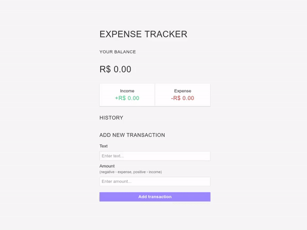
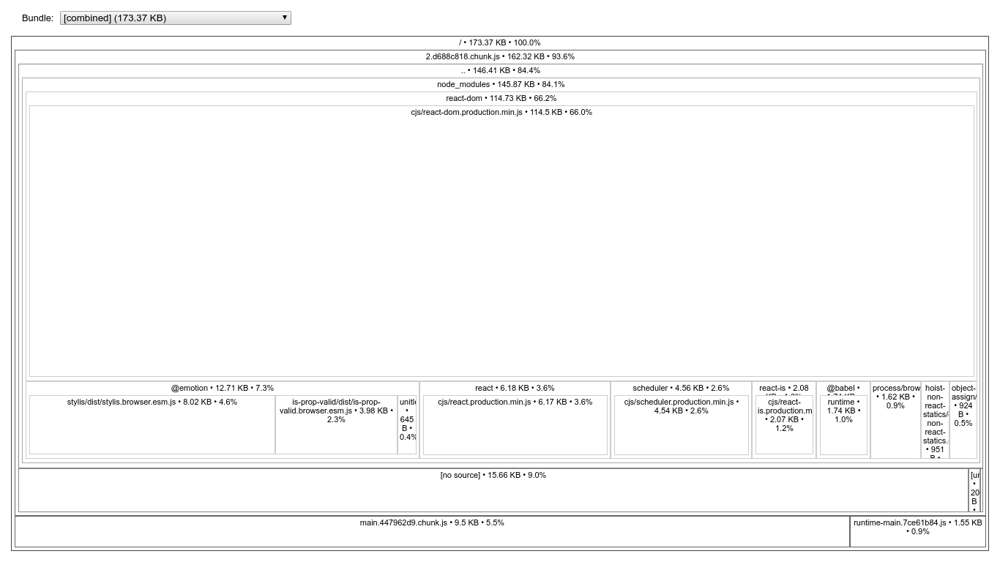

# react-expense-tracker
A expense tracker app made with React + Styled Components + RTK

## Try
```sh
git clone https://github.com/gustavonovaes/react-expense-tracker.git
cd react-expense-tracker

# npm i && npm run start
yarn && yarn start 
```

## Preview


### Analyzing the Bundle Size
```sh
$ yarn analyze
```


## License
[MIT](https://choosealicense.com/licenses/mit/)
